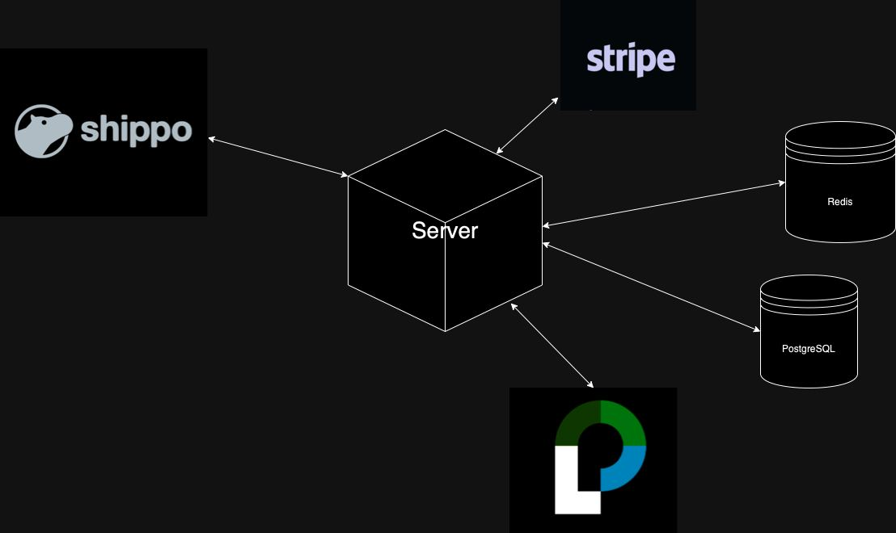
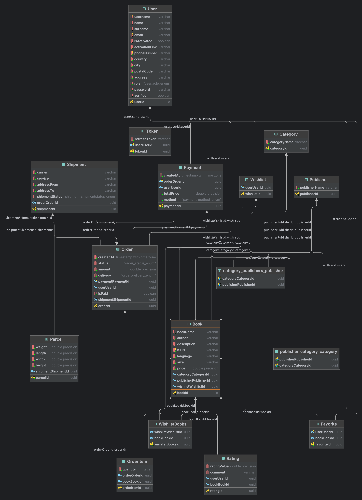

# Book marketplace

<!-- TABLE OF CONTENTS -->
<details>
  <summary>Table of Contents</summary>
  <ol>
    <li>
      <a href="#about-the-project">About The Project</a>
      <ul>
        <li><a href="#built-with">Built With</a></li>
      </ul>
    </li>
    <li>
      <a href="#getting-started">Getting Started</a>
      <ul>
        <li><a href="#prerequisites">Prerequisites</a></li>
        <li><a href="#installation">Installation</a></li>
      </ul>
    </li>
    <li><a href="#usage">Usage</a></li>
    <li><a href="#contributing">Contributing</a></li>
    <li><a href="#license">License</a></li>
    <li><a href="#contact">Contact</a></li>
  </ol>
</details>

## About The Project

This is a marketplace for books where users can sell and buy the books 
they want. Payment is made via the Stripe service,
Authentication is done via the capabilities provided by  authentication middleware 
Passport.JS. 
Platform data is stored in PostgreSQL, and user sessions are stored 
in Redis. Also, domain-driven design was chosen as an architectural 
approach to facilitate further scaling or transition to more modern 
tools, as well as to modalize the program to divide it into several
desks, which would also simplify debugging or integration.

<p align="right">(<a href="#readme-top">back to top</a>)</p>

### Built With

This section describes the services, technologies and frameworks I used in my project Here are a few examples.

#### Technologies:
[](https://skillicons.dev)

#### Services:



#### Database schema:



<p align="right">(<a href="#readme-top">back to top</a>)</p>

## Getting Started

This is an example of how you may give instructions on setting up your project locally.
To get a local copy up and running follow these simple example steps.

### Prerequisites

This is an example of how to list things you need to use the software and how to install them.
* npm
  ```sh
  npm install
  ```

### Installation

_Below is an example of how you can instruct your audience on installing and setting up your app. This template doesn't rely on any external dependencies or services._

1. Get a API Key at Gmail, create your own API tokens in Stripe and SHIPPO
2. Clone the repo
   ```sh
   git clone https://github.com/hhuziuk/marketplace.git
   ```
3. Install NPM packages
   ```sh
   npm install
   ```
4. Enter your API data in `.env`
   ```ts
    PORT='ENTER_YOUR_API'

    GOOGLE_CLIENT_SECRET='ENTER_YOUR_API'
    GOOGLE_CLIENT_ID='ENTER_YOUR_API'
    GOOGLE_CLIENT_CALLBACK_URL='ENTER_YOUR_API'
    SESSION_SECRET='ENTER_YOUR_API'
    
    POSTGRES_HOST='ENTER_YOUR_API'
    POSTGRES_PORT='ENTER_YOUR_API'
    POSTGRES_USER='ENTER_YOUR_API'
    POSTGRES_PASSWORD='ENTER_YOUR_API'
    POSTGRES_DB='ENTER_YOUR_API'
    
    REDIS_PORT='ENTER_YOUR_API'
    REDIS_URL='ENTER_YOUR_API'
    REDIS_HOST='ENTER_YOUR_API'
    REDIS_SECRET='ENTER_YOUR_API'
    
    EMAIL_USER='ENTER_YOUR_API'
    EMAIL_PASS='ENTER_YOUR_API'
    EMAIL_PORT='ENTER_YOUR_API'
    EMAIL_HOST='ENTER_YOUR_API'
    
    SHIPPO_API_KEY='ENTER_YOUR_API'
    
    STRIPE_PUBLISHABLE_KEY='ENTER_YOUR_API'
    STRIPE_SECRET_KEY='ENTER_YOUR_API'
    
    API_URL='ENTER_YOUR_API'
   ```

<p align="right">(<a href="#readme-top">back to top</a>)</p>


## Usage

To get better acquainted with the usage, I recommend you to read the documentation written with Swagger

Or if you want to make some tests, i recommend you to import `MarketplaceOuter.postman_collection.json` to Postman.

<p align="right">(<a href="#readme-top">back to top</a>)</p>


## Contributing

Contributions are what make the open source community such an amazing place to learn, inspire, and create. Any contributions you make are **greatly appreciated**.

If you have a suggestion that would make this better, please fork the repo and create a pull request. You can also simply open an issue with the tag "enhancement".
Don't forget to give the project a star! Thanks again!

1. Fork the Project
2. Create your Feature Branch (`git checkout -b feature/Features`)
3. Commit your Changes (`git commit -m 'Add some Features'`)
4. Push to the Branch (`git push origin feature/Features`)
5. Open a Pull Request

<p align="right">(<a href="#readme-top">back to top</a>)</p>

## License

Distributed under the GPL-3.0 License. See `LICENSE.txt` for more information.

<p align="right">(<a href="#readme-top">back to top</a>)</p>


## Contact
Heorhii Huziuk - huziukwork@gmail.com

Project link: [https://github.com/hhuziuk/marketplace.git](https://github.com/hhuziuk/marketplace.git)

<p align="right">(<a href="#readme-top">back to top</a>)</p>